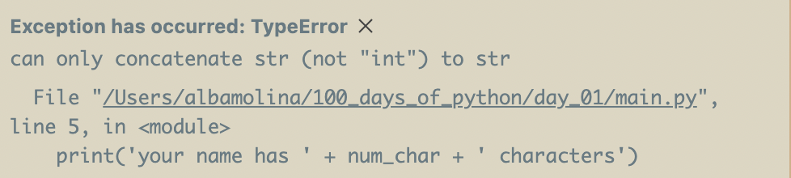

# Tip Calculator

***skills***
converting data types from one to another

***inputs***

1. total bill
2. how many people to split the bill
3. what percentage tip would you like to give

## Python Primitive Data Types

- strings
- integers
- booleans
- floats

***strings***

```python
'Hello'[0] # to get a hold of the first value
```

***subscripting*** ⬅ pulling a particular item from the string

***integers*** aka whole numbers

```python
print(123 + 345)
```

***float*** a floating point number like pie, they have decimal points

```python
print(3.1493)
```

***booleans*** used a lot in programs to test if something is true or false and your program responds accordingly

```python
True 
False
```

---

## TypeError, Type Checking, and Type Conversion

if you enter the following

```python
num_char = len(input('what is your name?'))
print('your name has ' + new_num_char + ' characters')
```

you will encounter the following error



## Changing or Converting Data Types or TypeCasting

is where we change from particular data type to another

```python
num_char = len(input('what is your name?'))

new_num_char = str(num_char) 
print('your name has ' + new_num_char + ' characters')

print(type(num_char))
```